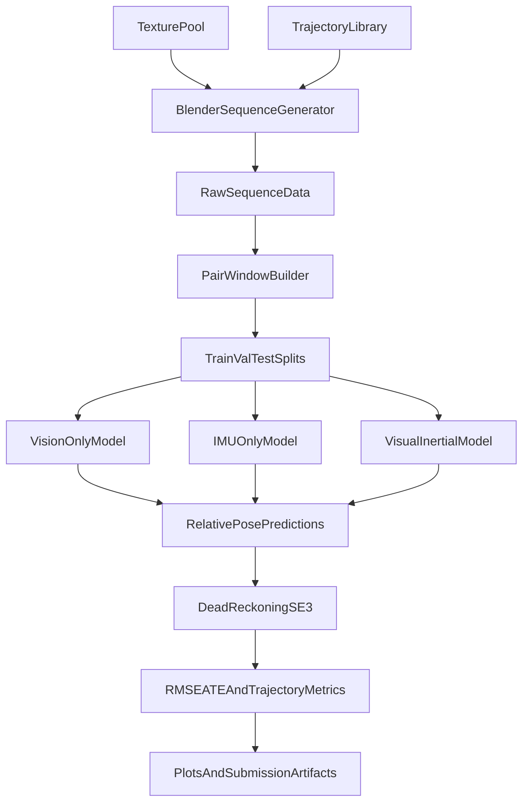

# Phase 2 Implementation Plan

## Goal
Build a complete, reproducible Phase 2 system that:
- generates realistic synthetic down-facing camera + IMU sequences in Blender,
- trains three relative-pose models (vision-only, IMU-only, visual-inertial),
- evaluates by dead-reckoning and trajectory error metrics,
- produces report-ready plots and artifacts.

## What is already done vs missing

### Already present (scaffold)
- [`/Users/myrrh/Documents/source/repos/Group12_p4/Phase2/Code/src_blender/blender.py`](/Users/myrrh/Documents/source/repos/Group12_p4/Phase2/Code/src_blender/blender.py): scene loop, camera frame scheduling, pose CSV writer stub.
- [`/Users/myrrh/Documents/source/repos/Group12_p4/Phase2/Code/src_blender/intrinsics.py`](/Users/myrrh/Documents/source/repos/Group12_p4/Phase2/Code/src_blender/intrinsics.py): intrinsics API shape defined, math notes included.
- [`/Users/myrrh/Documents/source/repos/Group12_p4/Phase2/Code/src_blender/materials.py`](/Users/myrrh/Documents/source/repos/Group12_p4/Phase2/Code/src_blender/materials.py): material helper function stubs.
- [`/Users/myrrh/Documents/source/repos/Group12_p4/Phase2/Code/src_blender/imu_sim.py`](/Users/myrrh/Documents/source/repos/Group12_p4/Phase2/Code/src_blender/imu_sim.py): IMU API shape present.
- [`/Users/myrrh/Documents/source/repos/Group12_p4/Phase2/Code/src_blender/trajectories.py`](/Users/myrrh/Documents/source/repos/Group12_p4/Phase2/Code/src_blender/trajectories.py): trajectory module placeholder.

### Missing (to implement)
- Actual Blender rendering + camera transform application.
- Usable trajectory generators with bounded motion and angles.
- IMU synthesis from trajectory/pose derivatives (with gravity handling + optional noise/bias).
- Consistent Phase 2 folder structure and reproducible run scripts.
- PyTorch datasets/dataloaders for pairwise image + IMU windows + relative pose labels.
- Three networks and their training loops.
- Dead-reckoning reconstruction + evaluation metrics + plots.
- User-facing docs for Blender usage and end-to-end reproduction.

## High-level architecture



## Recommended target file layout and low-level implementation plan

### 1) Blender data generation

- **File:** [`/Users/myrrh/Documents/source/repos/Group12_p4/Phase2/Code/src_blender/trajectories.py`](/Users/myrrh/Documents/source/repos/Group12_p4/Phase2/Code/src_blender/trajectories.py)
- **Purpose:** Deterministic, physically plausible trajectories with bounded roll/pitch (<45 deg) and realistic angular rates.
- **Detailed pseudocode:**
```python
# trajectory state at time t
# return position p_wb(t), orientation q_wb(t), velocity v_wb(t), accel a_wb(t)
def figure8(t, cfg):
    # x-y lemniscate with smooth z undulation
    x = A * sin(w*t)
    y = B * sin(w*t) * cos(w*t)
    z = z0 + Cz * sin(0.5*w*t)

    # derivatives for dynamics supervision / IMU synthesis
    vx, vy, vz = d/dt of x,y,z
    ax, ay, az = d/dt of vx,vy,vz

    # yaw from velocity direction; smooth when speed small
    yaw = atan2(vy, vx)
    roll = clamp(k_roll * ay, -roll_max, roll_max)
    pitch = clamp(k_pitch * ax, -pitch_max, pitch_max)

    q_wb = euler_to_quat(roll, pitch, yaw)
    return p_wb, q_wb, v_wb, a_wb
```

- **File:** [`/Users/myrrh/Documents/source/repos/Group12_p4/Phase2/Code/src_blender/materials.py`](/Users/myrrh/Documents/source/repos/Group12_p4/Phase2/Code/src_blender/materials.py)
- **Purpose:** Load floor textures and assign randomized scale/offset to avoid overfitting.
- **Detailed pseudocode:**
```python
def create_textured_floor(obj_plane, image_path, uv_scale):
    img = bpy.data.images.load(image_path)
    mat = bpy.data.materials.new("FloorMat")
    mat.use_nodes = True
    # Build nodes: TextureCoord -> Mapping(scale) -> ImageTexture -> PrincipledBSDF -> Output
    connect_nodes(mat.node_tree, img, uv_scale)
    assign_material(obj_plane, mat)
    return mat
```

- **File:** [`/Users/myrrh/Documents/source/repos/Group12_p4/Phase2/Code/src_blender/intrinsics.py`](/Users/myrrh/Documents/source/repos/Group12_p4/Phase2/Code/src_blender/intrinsics.py)
- **Purpose:** Compute pinhole K once and export in metadata.
- **Detailed pseudocode:**
```python
def fx_fy_cx_cy_from_blender(camera, W, H):
    lens_mm = camera.lens
    sensor_w = camera.sensor_width
    sensor_h = camera.sensor_height
    pixel_aspect = scene.render.pixel_aspect_x / scene.render.pixel_aspect_y

    fx = lens_mm * W / sensor_w
    fy = lens_mm * H * pixel_aspect / sensor_h
    cx = W * (0.5 - camera.shift_x)
    cy = H * (0.5 + camera.shift_y)
    return fx, fy, cx, cy
```

- **File:** [`/Users/myrrh/Documents/source/repos/Group12_p4/Phase2/Code/src_blender/imu_sim.py`](/Users/myrrh/Documents/source/repos/Group12_p4/Phase2/Code/src_blender/imu_sim.py)
- **Purpose:** Generate gyro/accel measurements at high rate between camera frames.
- **Detailed pseudocode:**
```python
def generate_imu_from_states(states, imu_rate, sigma_g, sigma_a):
    # states: time-indexed pose, vel, world-acc
    for each consecutive pair (t_k, R_wb_k, v_wb_k, a_wb_k):
        omega_body = log_SO3(R_wb_k.T @ R_wb_kplus1) / dt
        f_body = R_wb_k.T @ (a_wb_k - g_world)

        # optional random-walk bias and white noise
        b_g = b_g + n_bg * sqrt(dt)
        b_a = b_a + n_ba * sqrt(dt)
        gyro = omega_body + b_g + n_g
        accel = f_body + b_a + n_a

        write imu row: t_ns, wx, wy, wz, ax, ay, az
```

- **File:** [`/Users/myrrh/Documents/source/repos/Group12_p4/Phase2/Code/src_blender/blender.py`](/Users/myrrh/Documents/source/repos/Group12_p4/Phase2/Code/src_blender/blender.py)
- **Purpose:** End-to-end sequence generator and disk exporter.
- **Detailed pseudocode:**
```python
def run_demo(output_dir, duration, imu_rate, cam_rate, seed):
    setup_scene(engine='EEVEE', resolution=(640,480))
    create_large_plane_and_random_texture()
    cam = ensure_camera_downfacing()

    init csv files: poses.csv, imu.csv, camera_info.json
    next_cam_t = 0
    for t in np.arange(0, duration, 1/imu_rate):
        state = trajectory(t)
        set_camera_pose(cam, state.pose)

        if t >= next_cam_t - eps:
            render frame to cam0/data/timestamp.png
            save gt relative/absolute pose row
            next_cam_t += 1/cam_rate

        accumulate state for IMU synthesis

    imu_rows = generate_imu_from_states(states, imu_rate, ...)
    save imu rows to imu0/data.csv
    save intrinsics/extrinsics metadata
```

### 2) Dataset preparation for learning

- **File (new):** [`/Users/myrrh/Documents/source/repos/Group12_p4/Phase2/Code/data/build_pairs.py`](/Users/myrrh/Documents/source/repos/Group12_p4/Phase2/Code/data/build_pairs.py)
- **Purpose:** Convert raw sequences into supervised samples `(I_t, I_t+Delta, IMU[t:t+Delta], relative_pose)`.
- **Detailed pseudocode:**
```python
def build_pair_samples(seq_dir, cam_stride=10):
    imgs = load_sorted_images(seq_dir/cam0/data)
    imu = load_imu_csv(seq_dir/imu0/data.csv)
    poses = load_pose_csv(seq_dir/groundtruth.csv)

    for i in range(0, len(imgs)-cam_stride):
        t0, t1 = imgs[i].ts, imgs[i+cam_stride].ts
        imu_win = imu[(imu.ts >= t0) & (imu.ts <= t1)]
        T_w_c0 = pose_at(t0)
        T_w_c1 = pose_at(t1)
        T_c0_c1 = inv(T_w_c0) @ T_w_c1

        save sample index with paths, imu window, rel pose label
```

- **File (new):** [`/Users/myrrh/Documents/source/repos/Group12_p4/Phase2/Code/data/dataset.py`](/Users/myrrh/Documents/source/repos/Group12_p4/Phase2/Code/data/dataset.py)
- **Purpose:** PyTorch `Dataset`/`DataLoader` wrappers with normalization and augmentation.
- **Detailed pseudocode:**
```python
class VIOPairDataset(torch.utils.data.Dataset):
    def __getitem__(idx):
        load image pair
        load imu window (pad/truncate to fixed N)
        convert rel pose to target vector [tx,ty,tz,qx,qy,qz,qw]
        apply image transforms
        return dict(img0, img1, imu_seq, target_pose)
```

### 3) Model implementations (three required networks)

- **File (new):** [`/Users/myrrh/Documents/source/repos/Group12_p4/Phase2/Code/models/vision_only.py`](/Users/myrrh/Documents/source/repos/Group12_p4/Phase2/Code/models/vision_only.py)
- **Purpose:** CNN-based image pair encoder and relative pose regressor.
- **Detailed pseudocode:**
```python
class VisionOnlyNet(nn.Module):
    # Siamese encoder + feature fusion + MLP head
    def forward(img0, img1):
        f0 = encoder(img0)
        f1 = encoder(img1)
        f = concat(f0, f1, f1-f0)
        pose = mlp(f)
        return pose
```

- **File (new):** [`/Users/myrrh/Documents/source/repos/Group12_p4/Phase2/Code/models/imu_only.py`](/Users/myrrh/Documents/source/repos/Group12_p4/Phase2/Code/models/imu_only.py)
- **Purpose:** 1D temporal IMU model (BiGRU/TCN) to estimate relative pose.
- **Detailed pseudocode:**
```python
class IMUOnlyNet(nn.Module):
    def forward(imu_seq):
        h = temporal_encoder(imu_seq)   # [N,6] -> latent
        pose = mlp(h)
        return pose
```

- **File (new):** [`/Users/myrrh/Documents/source/repos/Group12_p4/Phase2/Code/models/vi_fusion.py`](/Users/myrrh/Documents/source/repos/Group12_p4/Phase2/Code/models/vi_fusion.py)
- **Purpose:** Mid-level fusion of visual and inertial embeddings.
- **Detailed pseudocode:**
```python
class VIFusionNet(nn.Module):
    def forward(img0, img1, imu_seq):
        fv = vision_encoder_pair(img0, img1)
        fi = imu_encoder(imu_seq)
        z = fusion_block(concat(fv, fi))
        pose = regressor(z)
        return pose
```

### 4) Losses, training, and evaluation

- **File (new):** [`/Users/myrrh/Documents/source/repos/Group12_p4/Phase2/Code/train/losses.py`](/Users/myrrh/Documents/source/repos/Group12_p4/Phase2/Code/train/losses.py)
- **Purpose:** Relative pose loss with translation and rotation terms.
- **Detailed pseudocode:**
```python
def pose_loss(pred, gt, w_t=1.0, w_r=1.0):
    t_loss = L1(pred_t, gt_t)
    r_loss = geodesic_quat_loss(pred_q, gt_q)
    return w_t*t_loss + w_r*r_loss
```

- **File (new):** [`/Users/myrrh/Documents/source/repos/Group12_p4/Phase2/Code/train/train.py`](/Users/myrrh/Documents/source/repos/Group12_p4/Phase2/Code/train/train.py)
- **Purpose:** Unified trainer supporting all three model types.
- **Detailed pseudocode:**
```python
def train_one_config(model_type, cfg):
    build dataloaders
    model = build_model(model_type)
    for epoch in range(cfg.epochs):
        for batch in train_loader:
            pred = model(...)
            loss = pose_loss(pred, batch.target)
            backward + optimizer step
        validate and checkpoint best
```

- **File (new):** [`/Users/myrrh/Documents/source/repos/Group12_p4/Phase2/Code/eval/dead_reckoning.py`](/Users/myrrh/Documents/source/repos/Group12_p4/Phase2/Code/eval/dead_reckoning.py)
- **Purpose:** Compose relative transforms to recover global trajectory.
- **Detailed pseudocode:**
```python
def integrate_relative_poses(rel_poses, T0=np.eye(4)):
    T = T0
    traj = [T]
    for dT in rel_poses:
        T = T @ dT
        traj.append(T)
    return traj
```

- **File (new):** [`/Users/myrrh/Documents/source/repos/Group12_p4/Phase2/Code/eval/metrics.py`](/Users/myrrh/Documents/source/repos/Group12_p4/Phase2/Code/eval/metrics.py)
- **Purpose:** ATE RMSE (with optional SE(3) alignment), RPE, and trajectory plots.
- **Detailed pseudocode:**
```python
def ate_rmse(pred_xyz, gt_xyz, align=True):
    if align:
        pred_xyz = umeyama_align(pred_xyz, gt_xyz)
    return sqrt(mean(sum((pred_xyz - gt_xyz)^2, axis=1)))
```

- **File (new):** [`/Users/myrrh/Documents/source/repos/Group12_p4/Phase2/Code/eval/plot_results.py`](/Users/myrrh/Documents/source/repos/Group12_p4/Phase2/Code/eval/plot_results.py)
- **Purpose:** Generate comparison figures required in report.

### 5) Configuration and reproducibility

- **File (new):** [`/Users/myrrh/Documents/source/repos/Group12_p4/Phase2/Code/config/default.yaml`](/Users/myrrh/Documents/source/repos/Group12_p4/Phase2/Code/config/default.yaml)
- **Purpose:** Central settings for render rates, model hyperparameters, and train/eval paths.

- **File (new):** [`/Users/myrrh/Documents/source/repos/Group12_p4/Phase2/README.md`](/Users/myrrh/Documents/source/repos/Group12_p4/Phase2/README.md)
- **Purpose:** Exact commands for data generation, training each model, and evaluation.

## Key concepts documentation (beginner-focused)

### Blender essentials for this project
- **Scene graph:** objects (camera, plane, lights) live in world coordinates; camera pose is `matrix_world`.
- **Coordinate frames:** define and document `world`, `body/camera`, and IMU frames clearly before coding any math.
- **Camera model in Blender:** lens (mm), sensor size, and shifts map to pinhole intrinsics `(fx, fy, cx, cy)`.
- **Rendering loop:** set camera pose -> set output filepath -> render still -> repeat.
- **Texture randomization:** changing floor texture and UV scale prevents the model from memorizing one pattern.
- **Realism constraints:** bound acceleration/angular velocity and keep plane edges out of view.

### Blender documentation links (implementation-focused)
- **Blender Python API index (start here):** [https://docs.blender.org/api/current/](https://docs.blender.org/api/current/)
- **`bpy` module reference:** [https://docs.blender.org/api/current/bpy.html](https://docs.blender.org/api/current/bpy.html)
- **Scene and context (`bpy.context.scene`, active camera):** [https://docs.blender.org/api/current/bpy.context.html](https://docs.blender.org/api/current/bpy.context.html)
- **Render settings (`scene.render`, filepath, resolution, FPS):** [https://docs.blender.org/api/current/bpy.types.RenderSettings.html](https://docs.blender.org/api/current/bpy.types.RenderSettings.html)
- **Render operator (`bpy.ops.render.render`):** [https://docs.blender.org/api/current/bpy.ops.render.html](https://docs.blender.org/api/current/bpy.ops.render.html)
- **Camera type and properties (`lens`, sensor, shifts):** [https://docs.blender.org/api/current/bpy.types.Camera.html](https://docs.blender.org/api/current/bpy.types.Camera.html)
- **Object transforms (`matrix_world`, location, rotation):** [https://docs.blender.org/api/current/bpy.types.Object.html](https://docs.blender.org/api/current/bpy.types.Object.html)
- **Math utilities (`mathutils` vectors, matrices, quaternions):** [https://docs.blender.org/api/current/mathutils.html](https://docs.blender.org/api/current/mathutils.html)
- **Materials and node trees (`use_nodes`, shader graph):** [https://docs.blender.org/api/current/bpy.types.Material.html](https://docs.blender.org/api/current/bpy.types.Material.html)
- **Node graph API (`ShaderNodeTexImage`, links):** [https://docs.blender.org/api/current/bpy.types.NodeTree.html](https://docs.blender.org/api/current/bpy.types.NodeTree.html)
- **Image data API (`bpy.data.images.load`):** [https://docs.blender.org/api/current/bpy.types.BlendDataImages.html](https://docs.blender.org/api/current/bpy.types.BlendDataImages.html)
- **Meshes and primitive creation:** [https://docs.blender.org/api/current/bpy.ops.mesh.html](https://docs.blender.org/api/current/bpy.ops.mesh.html)
- **UV editing/data API (for texture scaling/tiling):** [https://docs.blender.org/api/current/bpy.types.MeshUVLoopLayer.html](https://docs.blender.org/api/current/bpy.types.MeshUVLoopLayer.html)
- **Running Blender scripts from CLI (`--background --python`):** [https://docs.blender.org/manual/en/latest/advanced/command_line/arguments.html](https://docs.blender.org/manual/en/latest/advanced/command_line/arguments.html)

### VIO/deep learning essentials
- **Relative pose target:** model predicts transform from frame `t` to `t+Delta`.
- **Temporal alignment:** IMU window must exactly cover timestamps between the two RGB frames.
- **Dead-reckoning:** compose predicted relative transforms sequentially to obtain trajectory.
- **Rotation representation:** use normalized quaternion outputs or 6D rotation representation to avoid singularities.
- **Loss balancing:** translation and rotation have different scales; tune weighting coefficients.
- **Generalization:** split train/test by distinct trajectories and textures, not random adjacent frames only.

## Detailed TODO checklist (current status)

- [x] Phase 2 Blender module scaffolding exists in `src_blender`.
- [ ] Implement trajectory library (`figure8`, circle, aggressive, hover) with derivative outputs.
- [ ] Implement actual Blender render pipeline in `blender.py` (camera transform + png export).
- [ ] Implement camera intrinsics extraction and save camera metadata.
- [ ] Implement IMU simulator with gravity/body-frame conversion and noise options.
- [ ] Add sequence-level manifest and deterministic seed handling.
- [ ] Create train/val/test split tooling by sequence, not by individual frames.
- [ ] Build PyTorch dataset class for `(img0, img1, imu_seq, rel_pose)`.
- [ ] Implement `VisionOnlyNet` and baseline training.
- [ ] Implement `IMUOnlyNet` and baseline training.
- [ ] Implement `VIFusionNet` and fusion training.
- [ ] Implement dead-reckoning and metric computation (ATE RMSE at minimum).
- [ ] Generate required trajectory comparison plots for all three models.
- [ ] Write Phase 2 README with full run commands and defaults.
- [ ] Create report figures/tables and summarize findings/failure modes.

## Execution order (recommended)
1. Finish Blender data generation and verify one short sequence manually.
2. Build pairwise dataset + sanity plots (sample images, IMU traces, relative pose histograms).
3. Train vision-only baseline first (easiest debugging path).
4. Train IMU-only model, then visual-inertial fusion model.
5. Run full evaluation and generate final artifacts for submission.

## Validation gates
- **Data gate:** timestamps monotonic; IMU frequency near target; frame-IMU windows aligned.
- **Model gate:** train loss decreases; validation does not diverge; outputs have plausible scales.
- **Trajectory gate:** dead-reckoned path is smooth and approximately follows GT trend.
- **Submission gate:** all required files and plots reproducible from README commands.
